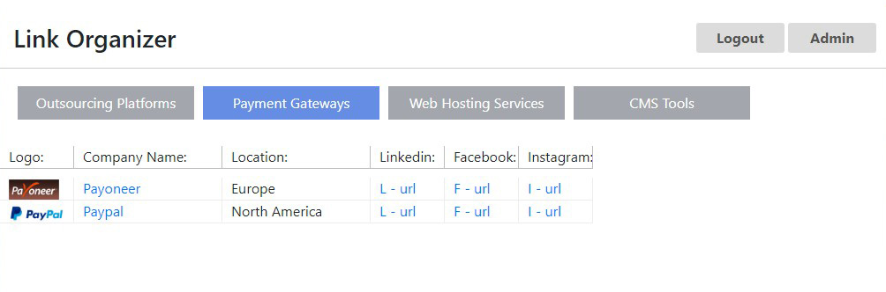
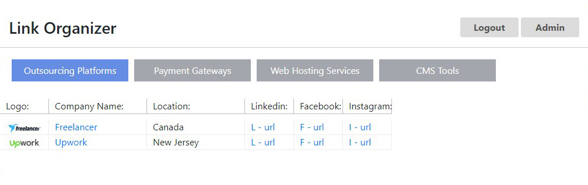
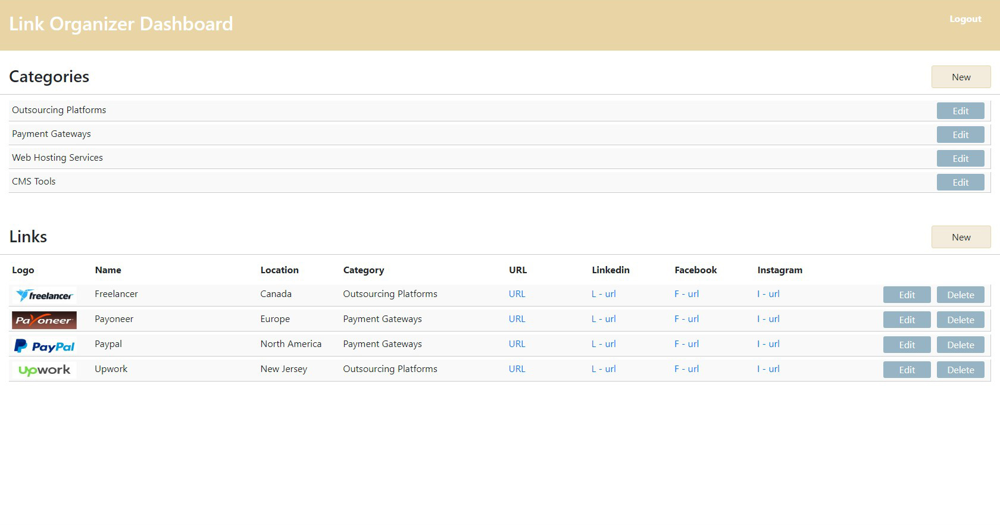
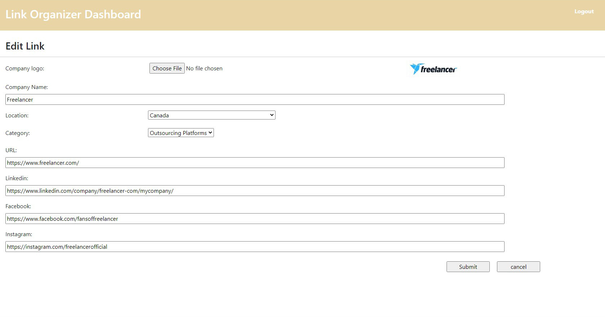
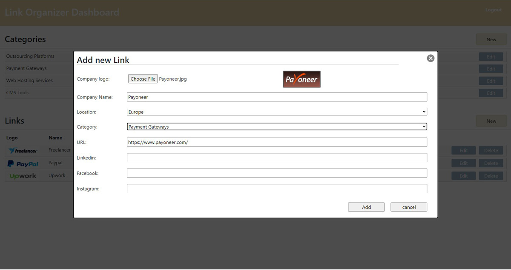
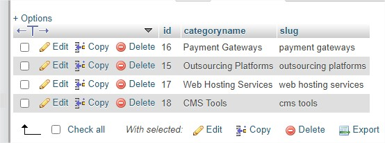
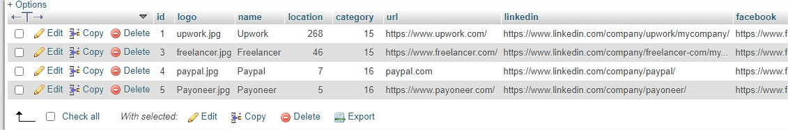
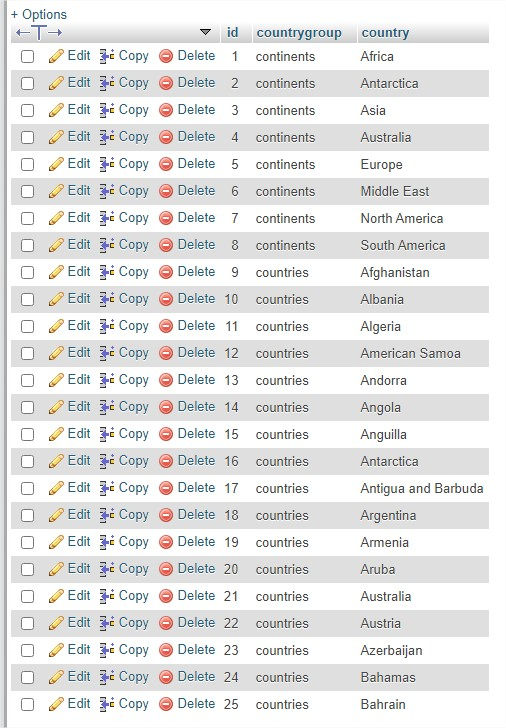

# link-organizer
Simple link list application with custom admin section

What you can get with this application is a list of companies and their details such as Logo, company name website URL, Linkedin page, etc.
I found this very useful as a sort of website bookmarks, where you got a nice wide clean list of companies stored in categories (which also can be modified) and with a simple click on you get redirected to their official website page address.
I make this page with PHP and all styles with CSS to have a nice clean layout, including the Admin section.

<strong>Screenshots:</strong>

